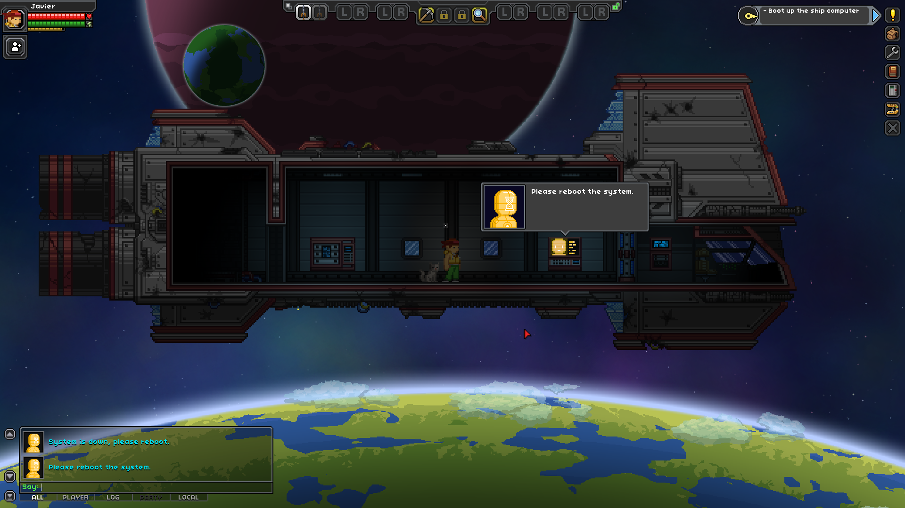
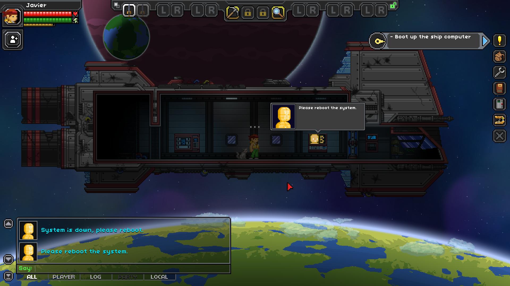

# Larger User Interface

This mod changes the minimum user interface scale from 1x to 2x, and the maximum
from 2x to 3x. It also lowers the right sidebar a little, so that the quest tracker
won't overlap with the central top bar.

If the screen resolution is greater than 1800 x 950 pixels the user interface will
be scaled by a factor of 3, otherwise it will be scaled by a factor of 2.

## Screenshots

Without Larger User Interface (1920 x 1080 pixels):

With Larger User Interface (1920 x 1080 pixels):

